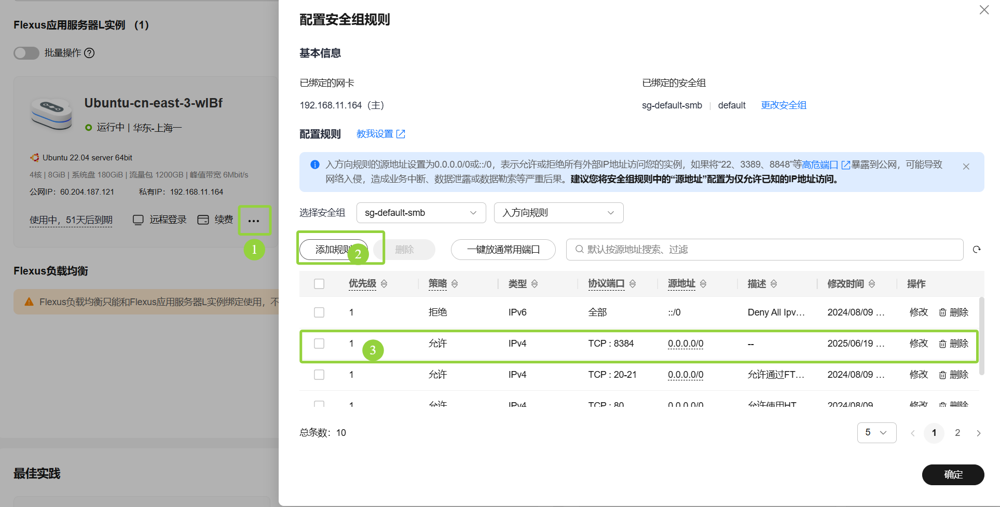
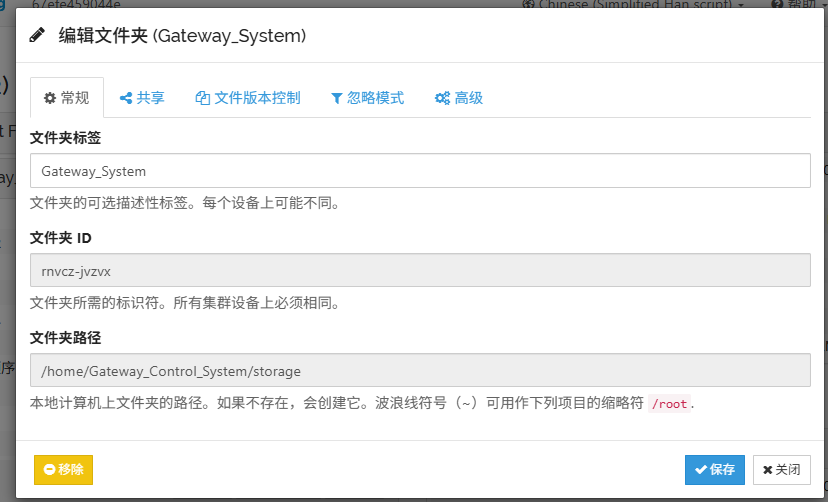
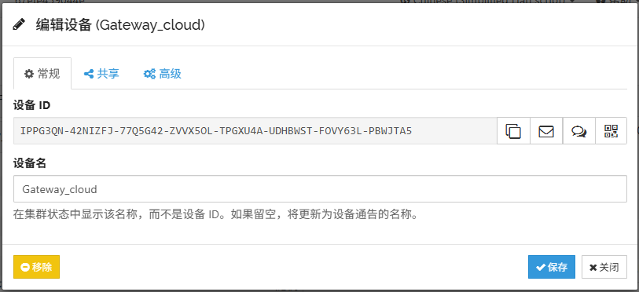
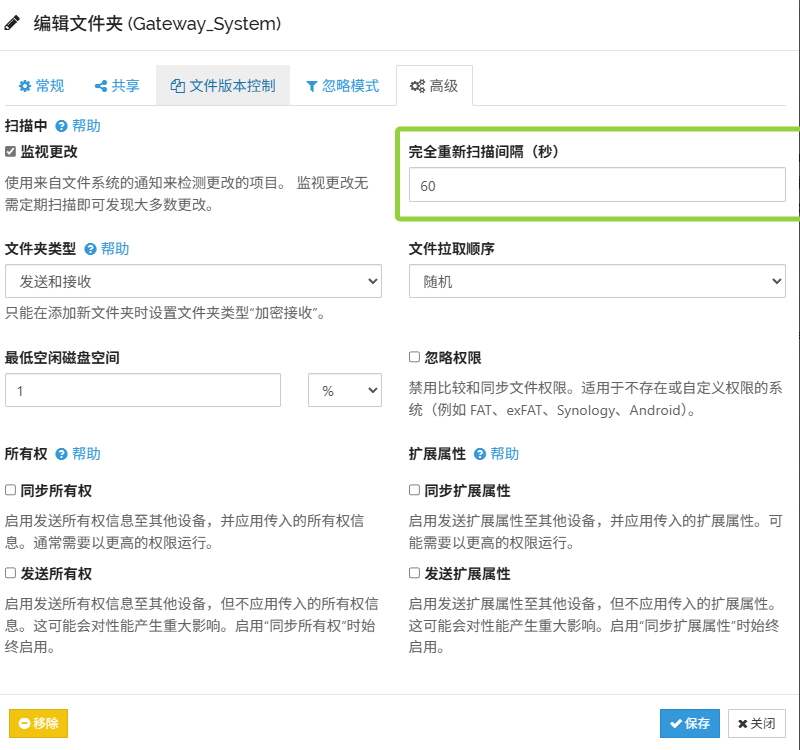
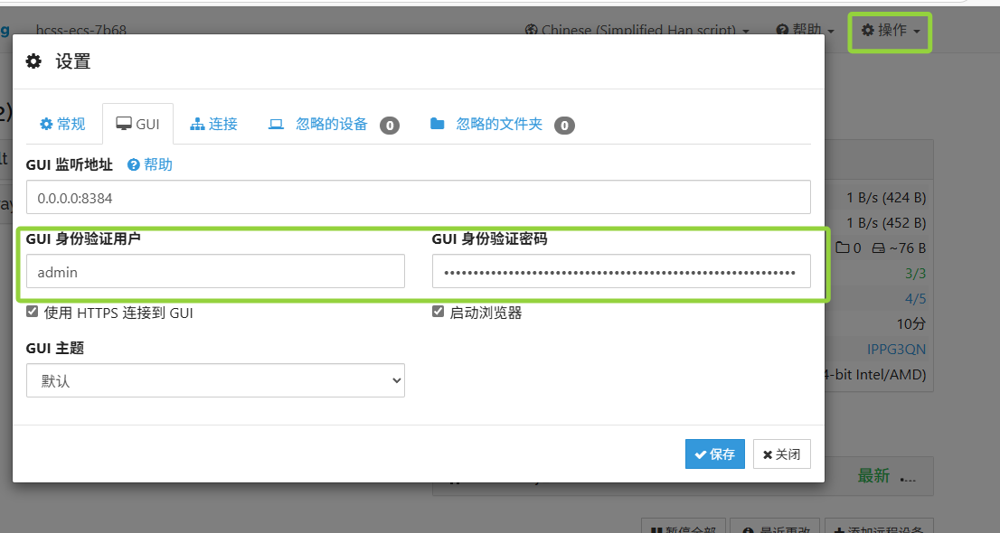

## 虚拟串口

调试时使用socat虚拟串口：
    串口-串口    ：  socat -d -d pty,b115200,raw,echo=0 pty,b115200,raw,echo=0
    串口-TCP服务器:  socat -d -d pty,b115200,raw,nonblock,ignoreeof,cr,echo=0 TCP4-LISTEN:2234,reuseaddr
    串口-TCP客户端： socat -d -d pty,b115200,raw,nonblock,ignoreeof,cr,echo=0  TCP:localhost:1234

    CMD_FILEINFO = 0x01,     // 文件信息    : echo -e -n "\x69\x96\x01test.txt-31-3\x00\x00\x0D\x0A" > /dev/pts/2
    CMD_FILEID   = 0x02,     // 文件ID      : echo -e -n "\x69\x96\x02test.txt-01\x00\x00\x00\x00\x0D\x0A" > /dev/pts/2
    CMD_TUNKDATA = 0x03,     // 块数据      : echo -e -n "\x69\x96\x030000-1234567890\x0D\x0A" > /dev/pts/2
                                              echo -e -n "\x69\x96\x030001-1234567890\x0D\x0A" > /dev/pts/2
                                              echo -e -n "\x69\x96\x030002-1\x00\x00\x00\x00\x00\x00\x00\x00\x00\x0D\x0A" > /dev/pts/2
    CMD_ACK      = 0x04,     // ACK信息     : echo -e -n "\x69\x96\x0401\x00\x00\x00\x00\x00\x00\x00\x00\x00\x00\x00\x00\x00\x0D\x0A" > /dev/pts/2
    CMD_RETRANS  = 0x05      // 重传块数据  : echo -e -n "\x69\x96\x0501-00-01\x00\x00\x00\x00\x00\x00\x00\x0D\x0A" > /dev/pts/2

## 启动rabbitmq-server服务

    root@ service rabbitmq-server restart
    注意：如果device_control出现RabbitMQ建立连接时,发生未知的Response Server错误
    请重新设置一下用户权限：
        systemctl enable rabbitmq-server                                              \
        rabbitmqctl add_user user 123456                                              \
        rabbitmqctl set_user_tags user administrator                                  \
        rabbitmqctl set_permissions -p / user ".*" ".*" ".*"                          \
        service rabbitmq-server restart                                               \
## 重启apache服务

    root@ service apache2 restart

## 配置apache服务器

* 配置/etc/apache2/apache2.conf文件
    ServerName localhost:80

* 配置/etc/apache2/sites-available/000-default.conf文件，绑定wsgi接口
    <VirtualHost *:80>
  
        ServerName localhost
      
        DocumentRoot /home/Gateway_Management_System/web
        WSGIScriptAlias / /home/Gateway_Management_System/web/webapp.wsgi
      
        ErrorLog /home/Gateway_Management_System/logs/error.log
        CustomLog /home/Gateway_Management_System/logs/access.log combined
        
        # 指定虚拟环境路径
        WSGIDaemonProcess your_app_name python-home=/opt/venv/
        WSGIProcessGroup your_app_name

        <Directory /home/Gateway_Management_System/web>
            WSGIApplicationGroup %{GLOBAL}
            Require all granted

            
        </Directory>
  
    </VirtualHost>

* 使能配置 root@ a2ensite 000-default.conf 
* 重启apache服务 root@ service apache2 restart

## 配置Syncthing文件同步功能
* 1.doker中已经完成Syncthing下载，在云服务器中，根据dokerfile命令安装Syncthing。
* 启动服务：syncthing
 
* 2.修改配置文件/root/.local/state/syncthing/config.xm（默认路径是/root/.local/state/state/syncthingconfig.xml​,如果忘记记录就全局搜索sudo find / -name "config.xml" -path "*/syncthing/*" 2>/dev/null）
* 修改  <address>127.0.0.1:8384</address>
* 改为 <address>0.0.0.1:8384</address>

* 3.查询服务器A和远程设备B的的device id（Syncthing 唯一标识，用于设备配对）
  syncthing --device-id
  (A:CF3ELJD-TY2TRJ6-DIJLG6Y-6JWIIWS-OOXFF4E-TFFACNM-OA7FFEG-2LZ4VA4         B:UIHJDGI-Y3VR7UR-UPB5CDX-4KDALX5-CT4E7IS-NDFGOGD-BYCLKVF-QKTKAQQ)
  
* 4配置Syncthing，建议条转到GUI配置

* -------4 命令行手动配置Syncthing（核心步骤）-----------
    * 步骤 1：配置云服务器端（设备A）
    * 1.1 备份配置文件（先定位配置文件，通用默认路径）
        ```bash
        # 先查找配置文件（必做！确认实际路径）
        sudo find / -name "config.xml" -path "*/syncthing/*" 2>/dev/null
        # 备份（替换为实际找到的路径）
        cp ~/.config/syncthing/config.xml ~/.config/syncthing/config.xml.bak
        # 编辑配置文件（推荐vim）
        vim ~/.config/syncthing/config.xml
    * 1.2 添加同步文件夹（云服务器的 /home/ubuntu/gateway）
        在配置文件的<folders>节点内插入以下 XML 内容：
      ```xml
        <folder id="gateway_sync" label="云服务器gateway目录" path="/home/ubuntu/gateway" type="sendreceive" rescanIntervalS="30" fsWatcherEnabled="true">
            <minDiskFree unit="%">1</minDiskFree>
            <paused>false</paused>
            <markerName>.stfolder</markerName>
        </folder>
      ```
    * 1.3 添加远程设备（Docker 远程机设备 B，替换 B_ID 为实际 ID）
        在配置文件的<devices>节点内插入以下 XML 内容：
      ```xml
        <device id="B_ID" name="Docker远程机" introducedBy="">
            <address>dynamic</address>
            <enabled>true</enabled>
            <syncFolders>
                <folder id="gateway_sync"></folder>
            </syncFolders>
            <maxSendKbps>0</maxSendKbps>
            <maxRecvKbps>0</maxRecvKbps>
        </device>
      ```
    * 1.4 修复权限并重启 Syncthing 服务
      ```bash
        # 确保配置文件权限正确
        chown -R $(whoami):$(whoami) ~/.config/syncthing/
        chmod 600 ~/.config/syncthing/config.xml
        # 重启服务使配置生效
        systemctl restart syncthing@$(whoami).service
      ```
* 步骤 2：配置 Docker 远程机端（设备 B）参考步骤一
* 步骤 3：验证同步效果
    * 3.1 设备 A 创建测试文件
    ```bash
        touch /home/ubuntu/gateway/test_sync.txt
        echo "Syncthing test content" > /home/ubuntu/gateway/test_sync.txt
    ```
    * 3.2 设备 B 验证宿主机挂载目录同步情况（等待 30 秒扫描间隔)
    ```bash
        cat /home/your_user/container_storage/test_sync.txt
    ```
    * 3.3 设备 B 验证容器内目录同步情况
    ```bash
        docker exec -it gateway_container cat /home/Gateway_Control_System/storage/test_sync.txt
    ```
    * 3.4 反向验证（设备 B 创建文件，设备 A 查看同步）
    ```bash
        # 设备B执行
        echo "Reverse test content" > /home/your_user/container_storage/test_reverse.txt
        # 设备A执行
        cat /home/ubuntu/gateway/test_reverse.txt
    ```

* -------4或者选择GUI配置----------------
    * a. 在云服务器中（华为云为例）设置防火墙：华为云在控制台-实例-设置实例安全规则，设置TCP规则将8384暴露给外部
    *    至此可以通过http://server1_public_IP:8483访问华为云syncthing的gui界面
    * b. 配置syncthing,在doker和华为云中输入syncthing启动服务
        服务器启动syncthing程序sudo systemctl restart syncthing(docker中先pkill syncthing关闭进程，然后syncthing启动)
        通过http://server1_public_IP:8384访问华为云公网gui（当前公网ip为118.25.97.132）
        通过http://127.0.0.1:8384访问doker下的本地gui
        配置文件夹、配置远程设备，根据官方文档https://docs.syncthing.net/intro/getting-started.html
        
        
    * 6. 在gui右上角设置选项中设置gui账号密码为root和********，文件夹选型中设置同步时间
    
    
---------配置结束---------​
## 配置Syncthing完成


## 十六进制查看文件

    root@ hexdump -C 2


## 部署到服务器启动自动启动配置（选配）
1. 给现有容器配置开机自启
docker update --restart=always gateway-env

2. 进入容器，配置启动脚本（确保容器启动时自动执行exec_management）
docker start gateway-env

docker exec -it gateway-env bash

4. 在容器内编辑~/.bashrc（或/etc/profile）docker默认通过bash启动 # 检查exec_management是否已运行，未运行则启动
```bash
echo "
# 修复：匹配带路径的进程名，避免重复启动
if ! pgrep -f './exec_management' > /dev/null; then
   cd /home/Gateway_Control_System/bin && sleep 1 && ./exec_management &
fi
" >> ~/.bashrc
" >> ~/.bashrc
```
5. 退出容器，重启容器生效
exit

docker restart gateway-env

7. 查看 .bashrc 末尾是否已追加命令
cat ~/.bashrc | tail -n 2

5. 检查 exec_management 是否后台运行
ps aux | grep exec_management


## 配置服务器的静态IP方便连接无线电等硬件设备（选配）
* 1. 编辑rc.local文件（开机rk3588板会自动执行这个脚本）这部分根据服务器平台配置各有不同，enP4p65s0为网卡型号需要替换，配置需要小心容易粗错
```bash
sudo tee /etc/rc.local > /dev/null << EOF
#!/bin/bash
# 配置enP4p65s0静态IP
ifconfig enP4p65s0 down
ifconfig enP4p65s0 192.168.1.100 netmask 255.255.255.0
route add default gw 192.168.1.1 enP4p65s0
ifconfig enP4p65s0 up
exit 0
EOF
```
```bash
#这是一些网络设置错误恢复的方法
# ========== 1. 强制激活双网卡（核心） ==========
sudo ip link set enP3p49s0 up
sudo ip link set enP4p65s0 up

# ========== 2. 重新触发DHCP获取IP/网关（恢复上网） ==========
sudo dhclient enP3p49s0  # 外网口自动获取上网参数
sudo dhclient enP4p65s0  # 局域网口也DHCP（恢复初始状态）

# ========== 3. 验证网卡状态（确认UP+有IP） ==========
ip addr show
```
* 2. 添加可执行权限（关键！否则开机不执行）
sudo chmod +x /etc/rc.local

* 3. 验证脚本（手动执行一次，确保无报错）
sudo /etc/rc.local
